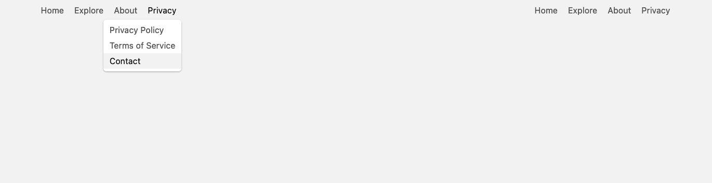

# Accessible Submenu With Javascript
[Github Pages Link](https://zoricm.github.io/accessible.submenu.with.javascript/)

# It features:
- Outside click closes submenu
- Click on submenu container closes submenu if it's previously opened
- Return key opens submenu
- Keyboard accessible using TAB key
